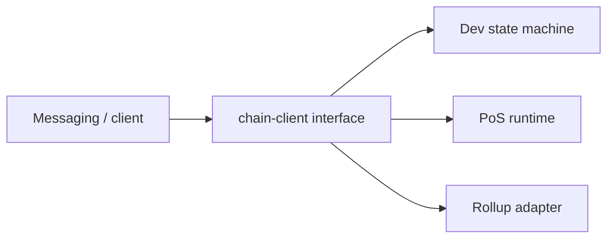

# Blockchain

The chain holds globally shared scarce or authoritative state.

It must **not** contain private chat content.

## On-chain

```text
username -> owner wallet
username ownership history
wallet -> identity root
wallet -> authorised passkey commitments
identity protocol version
relay registrations
validator set
protocol treasury
optional group ownership
```

## Off-chain (must stay off)

- private messages
- private message hashes by default
- private group messages
- attachments
- detailed presence history
- contact graphs
- exact location
- reports containing private plaintext
- read state
- conversation metadata

## Token purpose

May fund:

- validator incentives
- protocol treasury
- relay incentives / staking
- governance later
- anti-spam deposits later

Must **not** gate normal messaging, rooms, discovery, username registration,
or ordinary account use.

## Treasury model (first stage)

Avoid automated bandwidth mining initially.

Recommended:

- genesis treasury allocation
- official infrastructure funded by treasury grants
- validators receive predictable emissions or treasury payments
- relay operators may receive approved grants
- automatic proof-of-bandwidth deferred

Reason: operators can fabricate traffic and receipts; auto bandwidth rewards
are hard to secure.

## Implementation boundary

Consensus is a **separate module**.

First implementation may use any of:

1. minimal purpose-built proof-of-stake chain
2. application-specific rollup
3. temporary development chain with pluggable consensus
4. deterministic local replicated state machine until consensus exists

Chat development must proceed before production consensus is complete.



See [open-decisions.md](open-decisions.md) for production consensus, emissions,
and validator selection.
