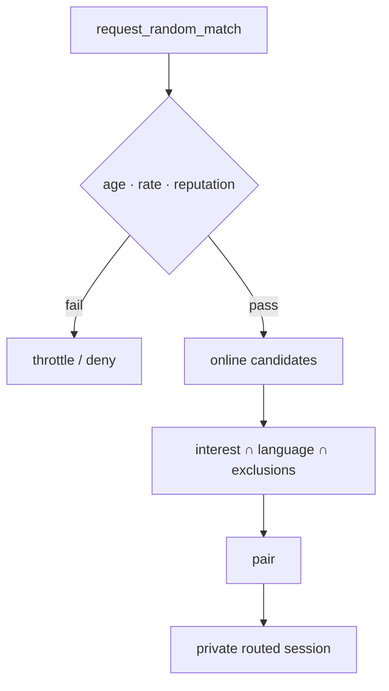

# Discovery

Multiple discovery systems. Private contact graphs must not be uploaded in
plaintext.

## Interest discovery

Users select interests from freeform tags, canonical tag IDs, public room
membership, or local preferences.

First implementation: **canonical normalised tags**.

```text
software.rust
music.experimental
photography.street
language.cantonese
```

## Mutual discovery

May derive from:

- direct contact graph intersections
- shared group membership
- shared chatroom participation

First implementation may limit mutuals to explicit shared groups and rooms.

## Nearby discovery (AD-19)

Optional and opt-in. **Post-MVP only** — not in first ship.

No precise coordinates. Coarse cells only (venue / ~1 km / suburb / city).

Location records must:

- expire quickly
- be unlinkable where possible
- never appear on-chain
- be hidden by default

## Language discovery

Users may specify:

- languages spoken
- preferred conversation languages
- optional proficiency

Matching prioritises shared preferred conversation languages.

## Link discovery

Links may resolve to:

- profile
- public chatroom
- private group invitation
- direct chat request
- random matching pool

## Group discovery

Discoverable groups may publish:

- group ID, name, description
- language, interest tags
- join policy
- approximate size

Private groups not publicly indexed unless explicitly enabled.

## Random matching

Combines:

- current online state
- interests
- language
- optional location
- reputation threshold
- exclusion lists
- recent-match avoidance

Random sessions use **private routed mode** by default.



See [reputation.md](reputation.md) and [transport.md](transport.md).
