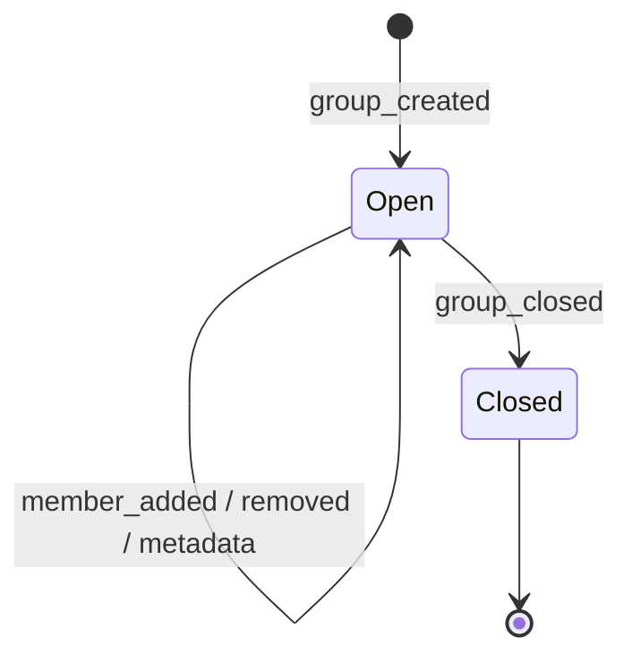

# Private group chats

Creator-controlled private groups.

## Authority

Creator can:

- add / remove members
- rename group / change metadata
- close the group
- optionally transfer ownership later (not required in MVP)

## Membership events

Signed group events:

```text
group_created
group_member_added
group_member_removed
group_metadata_changed
group_closed
```



## Encryption

MLS or another reviewed group protocol.

A removed member must not decrypt future messages after membership epoch
change.

## History

Group history remains on member devices.

New members receive earlier history **only** if an existing member explicitly
transfers it.

Default: **no automatic pre-membership history**.
