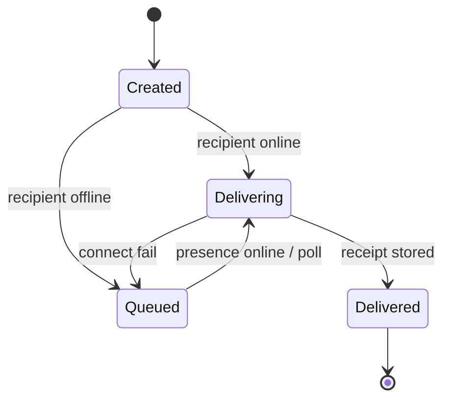
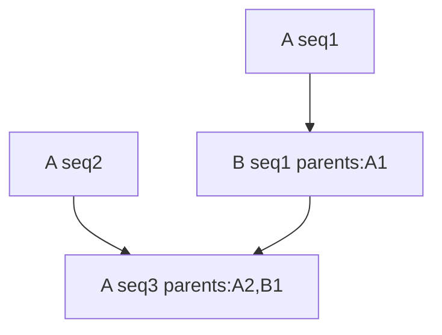

# Messaging

## Properties of private messages

- end-to-end encrypted
- signed
- immutable
- locally stored
- queued on sender while undelivered
- retried when recipient online
- deduplicated by message ID
- acknowledged as delivered after recipient storage

No read receipts. No editing. No remote deletion.

## Sender-side offline queue

If recipient offline:

1. sender encrypts and signs
2. sender stores encrypted outbound envelope locally
3. sender checks recipient presence periodically
4. default retry interval: **30 minutes**
5. immediate retry on presence-online events
6. when online: signalling → secure session → transmit
7. recipient stores and ACKs
8. sender marks delivered; drops retry obligation

Encrypted outbound may remain in local history after delivery.

**Sender device must be online** for undelivered messages to deliver.



## Retry scheduling

```text
on message creation:
  check current presence immediately

if offline:
  schedule retry for 30 minutes

when a presence-online event arrives:
  retry immediately

if connection fails:
  retry with bounded exponential backoff
  retain the normal 30-minute presence poll ceiling
```

Battery-aware clients may defer background retries per OS constraints.

## Delivery semantics

Not literal exactly-once network transmission.

Effectively-once user-visible delivery via:

- globally unique message IDs
- retransmission until ACK
- recipient deduplication
- idempotent storage
- stable acknowledgement records

Duplicate packets must never create duplicate visible messages.

## Delivered receipt

Means: **at least one currently authenticated recipient device has stored
the message locally.**

Does **not** mean opened or read.

```text
delivery_receipt {
  message_id
  recipient_device_id
  stored_at
  signature
}
```

UI may hide recipient device ID.

## Envelopes

Outer envelope:

```text
message_envelope {
  protocol_version
  message_id
  conversation_id
  sender_identity_id
  sender_device_id
  recipient_identity_id
  sender_sequence
  parent_ids[]
  created_at
  ciphertext
  signature
}
```

Sender signs canonical encoding excluding the signature field.

Encrypted payload:

```text
message_payload {
  content_type
  text
  reply_to_message_id?
  attachment_offer?
  client_metadata?
}
```

Initial release: plain text + attachment offers.

## Ordering

No single global canonical order. Use causal + per-sender ordering.

### Per-sender sequence

Monotonic sequence per conversation per sender: `1, 2, 3, ...`

### Causal references

Optional `parent_ids[]` = messages visible to sender at composition time.

### Stable local display order

1. causal dependencies  
2. sender sequence  
3. creation timestamp  
4. message ID as deterministic tie-breaker  

Timestamps are not fully trusted.



## Contact initiation

DM may start from: username search, shared link, mutual, shared group/room,
random match.

Receiver may accept, ignore, or block.

Unknown-user messages begin as **requests**:

- limited pending requests per account
- no attachments before acceptance
- no repeated request after rejection
- sender reputation gating for high volume
