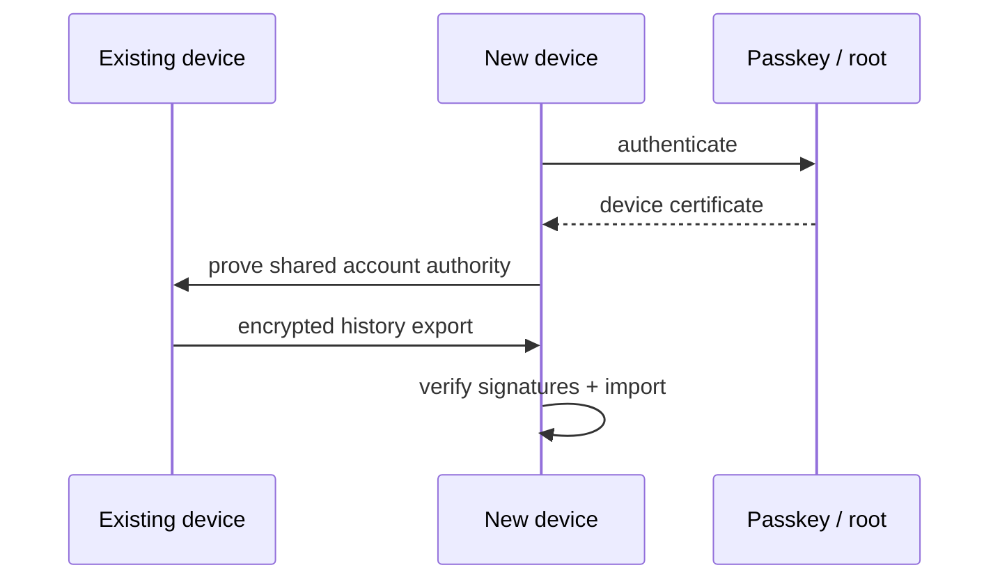

# Multi-device

A Nettle account may run on multiple devices.

## Login

Each device authenticates with a passkey on every interactive app open and
receives a device certificate valid until process death (AD-6).

## Message fanout

When a sender knows multiple active recipient devices, it may encrypt and
deliver to each active device.

A message is **delivered** after at least one authorised recipient device
stores it.

Whether every device always receives every DM is an [open decision](open-decisions.md).

## Device history transfer

History transfers peer-to-peer between devices on the same account.

Steps:

1. new device authenticates via passkey
2. receives device certificate
3. devices verify shared account authority
4. encrypted session established
5. existing device exports selected logs
6. new device verifies signatures and imports

## Conflict handling

History is append-only signed events.

If two devices create messages while disconnected, both branches are retained
and merged through deterministic event ordering.

## No cloud backup by default

Nettle does not provide central message backup by default.

Users keep at least one device copy or transfer history before losing a device.
