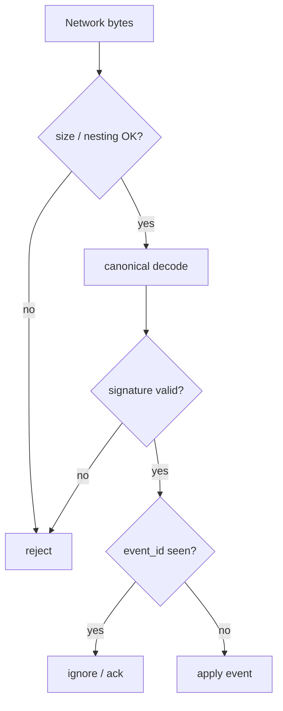

# Protocol event model

Versioned canonical event format.

## Base event

```text
nettle_event {
  protocol_version
  event_type
  event_id
  author_identity_id
  author_device_id
  created_at
  sequence
  parent_ids[]
  payload
  signature
}
```

## Encoding requirements

- deterministic canonical encoding
- forward-compatible unknown fields
- explicit protocol version
- capability negotiation
- maximum field sizes
- signature over canonical representation

## Candidate encodings

- **CBOR** (strong default for first implementation)
- MessagePack with canonicalisation rules
- Protocol Buffers with strict deterministic serialisation
- custom schema from a formal IDL

## Rules

- all schemas versioned
- malformed events rejected (size, nesting, timeouts)
- signature verification before expensive processing where possible
- duplicate events idempotent
- protocol test vectors before network integration



See [cryptography.md](cryptography.md) and [messaging.md](messaging.md).
