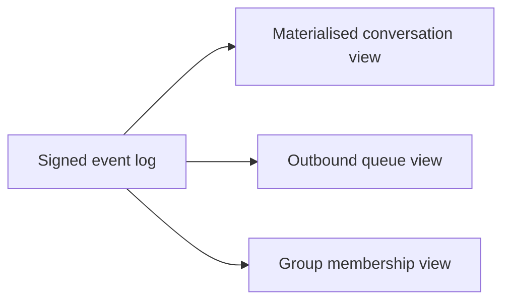

# Local storage

Client uses an encrypted local database.

## Storage groups

```text
account
wallet references
passkey metadata
device certificate
contacts
conversations
messages
outbound queue
delivery receipts
group state
room subscriptions
reputation state
block lists
attachment metadata
presence cache
```

## At-rest encryption

Local databases should be encrypted with keys protected by OS secure storage
where available.

## Append-only event log

Conversation and group state are signed append-only events.

Materialised views may be generated for UI performance.



## Outbound queue schema

```text
outbound_queue_item {
  message_id
  recipient_identity
  encrypted_envelope
  created_at
  last_attempt_at
  next_attempt_at
  attempt_count
  delivery_state
}
```

Process restarts must not lose queued messages.
