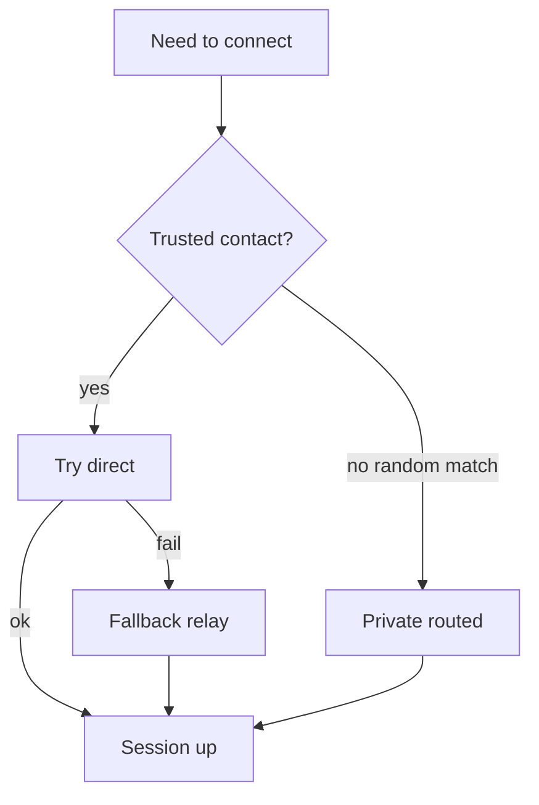

# Transport

## Connection modes

### Direct

```text
sender <-> recipient
```

Lowest latency and infrastructure cost. Peer IPs may be visible to each other.

### Private routed

```text
sender -> entry relay -> hop -> exit relay -> recipient
```

Peers do not directly learn each other's IP. Higher latency and bandwidth.
Each relay sees only a portion of the path.

### Fallback relay

```text
sender -> relay -> recipient
```

Used when direct NAT traversal fails. Relays transient encrypted traffic
**without** retaining private message history.

## Default routing policy

| Context | Default |
|---|---|
| Trusted contacts | Direct when possible |
| Random matching | Private routed |
| Public chatrooms | Relay-assisted gossip |
| Attachments | Direct; routed only if explicitly supported later |
| NAT failure | Fallback relay |



## Signalling

Exchanges:

- session offers / answers
- ICE candidates or equivalent transport data
- ephemeral connection identifiers
- protocol capabilities
- relay path requests

Signalling payloads must be authenticated and minimise persistent identifiers.

## Relay verification

Recognised relays publish:

- relay identity key
- supported protocol versions
- reproducible build hash
- source commit
- binary checksum
- operator identity or pseudonymous operator key
- service endpoints
- uptime information
- optional attestation evidence

Checksum proves binary matches a known build. It does **not** prove the
operator is not logging metadata or modifying the environment.

Layered trust:

- reproducible builds
- signed releases
- multiple independent operators
- optional remote attestation
- client-selected relay sets
- onion-style multi-hop routing

## Pluggability

Transports should be pluggable (QUIC, WebRTC, etc.). Messaging logic depends
on session abstractions, not a single socket type.

See [stack.md](stack.md).
